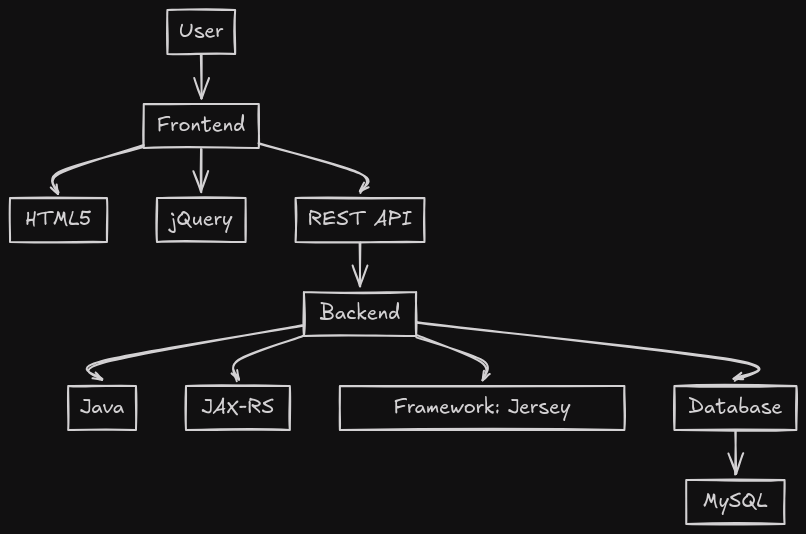

# Classroom Management Project

## Description
This project aims to develop a RESTful web service for managing information about classrooms, events, and assignments. The service is based on a MySQL database and uses Java with JAX-RS to implement REST APIs.

## Technologies Used
* **Backend:**
    * Java
    * JAX-RS
    * **Framework:** Spring Boot (or another JAX-RS framework)
    * **Database:** MySQL
    * **ORM:** Hibernate (optional)
* **Frontend:**
    * HTML5
    * jQuery

## Features
* **Authentication:** Login/logout for administrators.
* **Classroom Management:**
    * Creating, updating, and deleting classrooms.
    * Assigning a classroom to a group.
    * Reading basic information about a classroom.
    * Listing the equipment in a classroom.
* **Event Management:**
    * Creating, updating, and deleting events.
    * Reading information about an event.
    * Listing events associated with a specific classroom in a given week.
    * Listing current events and those in the next three hours.
    * Exporting all events for a given time interval in iCalendar format.
* **Import/Export:**
    * Exporting and importing classroom configuration in CSV format.
